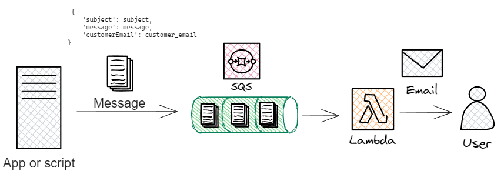

Se configuró una arquitectura de servicios en conjunto con SQS y Lambda de mensajería asíncrona y notificaciones genéricas por correo electrónico para gestionar las mismas con eventos específicos dentro de la plataforma de correo electrónico como lo pueden ser notificaciones de pedidos, ofertas, promociones, recordatorios, etc

La arquitectura implica el uso de una cola FIFO en Amazon SQS. Esta cola sirve como un intermediario eficiente para almacenar y organizar mensajes de notificación. Estos mensajes de las notificaciones desencadenan una función lambda encargada de  procesar las mismas y enviar las notificaciones por correo electrónico según corresponda